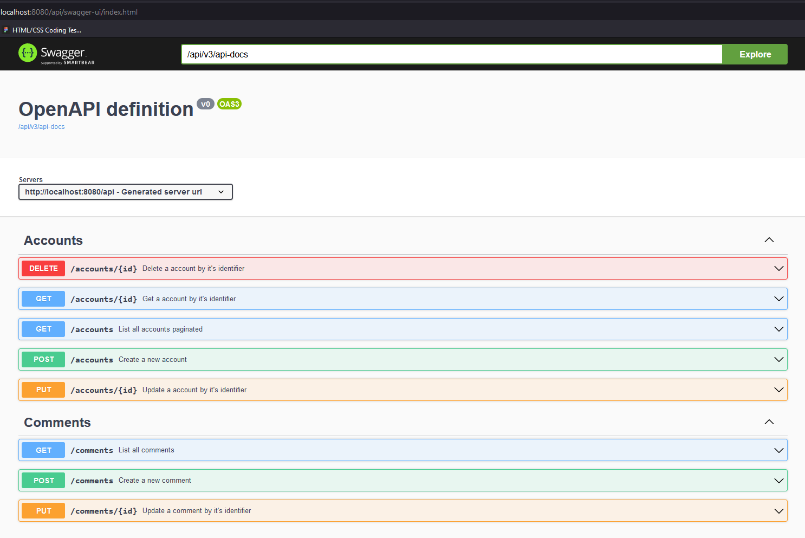
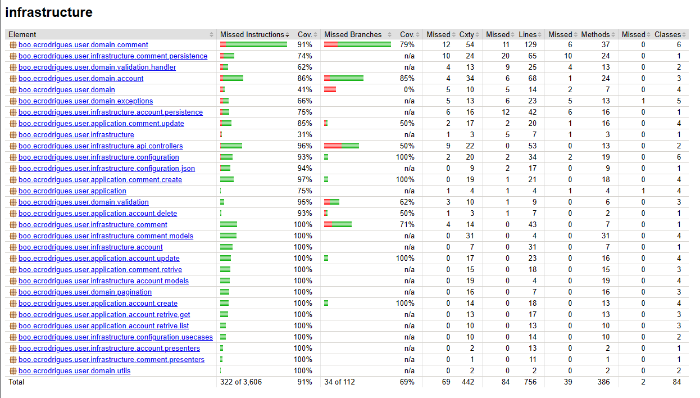

<center>
  <p align="center">
    
  </p>  
  <h1 align="center">🚀 BooWorld Services</h1>
  <p align="center">
    Using Clean Architecture, DDD, TDD and current market best practices
  </p>
</center>
<br />

- [Part 1](./README.md#part-1)
- [Part 2](./README.md#part-2)

## Part 1

## Part 2

### How to execute?

1. Clone the repository:
```sh
git clone https://github.com/ecr-developer/boo-coding-challenge.git
```

2. Upload the MongoDB database with Docker:

```shell
backend-user-api-java/docker-compose up -d
```

### Running with Docker
To run the application locally with Docker, we will use the `docker compose` and requires just three steps:
<br/>

#### 1. Generating the productive artifact (jar)

To generate the productive artifact, simply run the command:
```
cd backend-user-api-java
./gradlew bootJar
```

#### 2. Running independent containers (Optional)

To run MongoDB, simply execute the command below:
```shell
cd sandbox
./run.sh
```

### 3. Running the application alongside the other containers

```
cd sandbox/app
docker-compose --profile app up -d
```

> **Note.:** If you need to rebuild the image of application, an additional command is required:
```
docker compose build --no-cache app
```

#### Stopping containers

To stop the containers, just run the command:
```
docker compose --profile app stop
```

#### API Docs generated


#### Jacoco test report
Some files such as settings and properties were not removed from the coverage, files that would not need to be included in the metrics.

